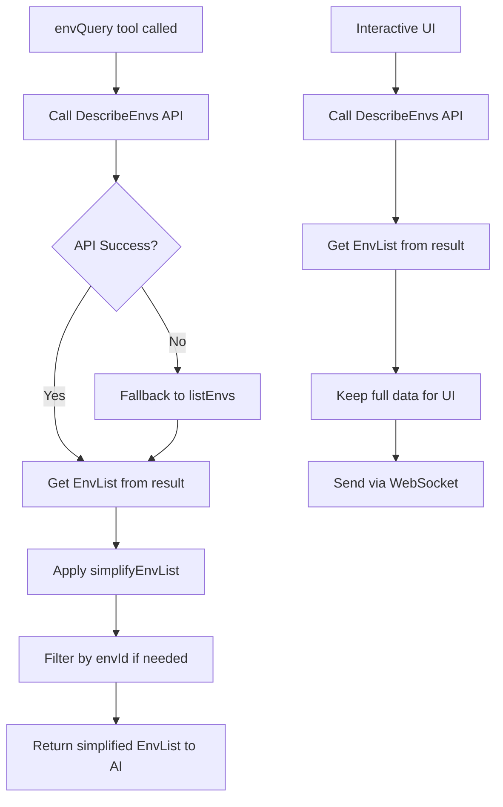

# 技术方案设计

## 架构概述

本方案通过字段精简函数，在 MCP 工具返回环境列表数据给 AI 助手之前，过滤掉不必要的字段，只保留核心且有用的字段，从而减少 token 消耗。

## 技术选型

- **实现方式**：在 `envQuery` 工具的 `list` 操作中，对返回结果进行字段映射和过滤
- **精简策略**：使用字段白名单机制，只保留必要的字段
- **兼容性**：保持返回数据结构为 `{ EnvList: [...] }` 格式，确保与现有代码兼容

## 核心设计

### 1. 字段精简函数

创建一个通用的字段精简函数，用于过滤环境列表数据：

```typescript
/**
 * Simplify environment list data by keeping only essential fields
 * @param envList - Full environment list from API
 * @returns Simplified environment list with only essential fields
 */
function simplifyEnvList(envList: any[]): any[] {
  if (!Array.isArray(envList)) {
    return envList;
  }

  return envList.map((env: any) => ({
    EnvId: env.EnvId,
    Alias: env.Alias,
    Status: env.Status,
    EnvType: env.EnvType,
    Region: env.Region,
    PackageName: env.PackageName,
    IsDefault: env.IsDefault,
  }));
}
```

### 2. 应用位置

字段精简需要在以下位置应用：

1. **`mcp/src/tools/env.ts`** - `envQuery` 工具的 `list` 操作
   - 在 `DescribeEnvs` API 调用成功后应用精简
   - 在降级到 `listEnvs()` 时也应用精简

2. **不应用的位置**（保持完整数据）：
   - `mcp/src/tools/interactive.ts` - 环境选择流程（内部使用，不返回给 AI）
   - `mcp/src/interactive-server.ts` - WebSocket 环境列表刷新（交互式界面）

### 3. 实现细节

#### 3.1 envQuery 工具实现

在 `mcp/src/tools/env.ts` 的 `envQuery` 工具中：

```typescript
case "list":
  try {
    const cloudbaseList = await getCloudBaseManager({...});
    result = await cloudbaseList.commonService("tcb").call({
      Action: "DescribeEnvs",
      Param: {...},
    });
    
    // Transform response format
    if (result && result.EnvList) {
      result = { EnvList: result.EnvList };
    } else if (result && result.Data && result.Data.EnvList) {
      result = { EnvList: result.Data.EnvList };
    } else {
      // Fallback
      result = await cloudbaseList.env.listEnvs();
    }
    
    // Apply field simplification for MCP tool response
    if (result && Array.isArray(result.EnvList)) {
      result.EnvList = simplifyEnvList(result.EnvList);
    }
  } catch (error) {
    // Fallback handling
    result = await cloudbaseList.env.listEnvs();
    if (result && Array.isArray(result.EnvList)) {
      result.EnvList = simplifyEnvList(result.EnvList);
    }
  }
  
  // Filter by envId if needed (existing logic)
  if (hasEnvId && result && Array.isArray(result.EnvList) && result.EnvList.length > 1) {
    result.EnvList = result.EnvList.filter((env: any) => env.EnvId === cloudBaseOptions?.envId);
  }
  break;
```

#### 3.2 字段精简函数实现

在 `mcp/src/tools/env.ts` 文件顶部添加工具函数：

```typescript
/**
 * Simplify environment list data by keeping only essential fields for AI assistant
 * This reduces token consumption when returning environment lists via MCP tools
 * @param envList - Full environment list from API
 * @returns Simplified environment list with only essential fields
 */
function simplifyEnvList(envList: any[]): any[] {
  if (!Array.isArray(envList)) {
    return envList;
  }

  return envList.map((env: any) => {
    // Only keep essential fields that are useful for AI assistant
    const simplified: any = {};
    
    if (env.EnvId !== undefined) simplified.EnvId = env.EnvId;
    if (env.Alias !== undefined) simplified.Alias = env.Alias;
    if (env.Status !== undefined) simplified.Status = env.Status;
    if (env.EnvType !== undefined) simplified.EnvType = env.EnvType;
    if (env.Region !== undefined) simplified.Region = env.Region;
    if (env.PackageName !== undefined) simplified.PackageName = env.PackageName;
    if (env.IsDefault !== undefined) simplified.IsDefault = env.IsDefault;
    
    return simplified;
  });
}
```

## 数据流图



## 字段映射表

| 保留字段 | 类型 | 用途 | 是否必需 |
|---------|------|------|---------|
| `EnvId` | string | 环境唯一标识，用于选择环境 | 是 |
| `Alias` | string | 环境别名，用于显示和识别 | 是 |
| `Status` | string | 环境状态（如 "NORMAL"），判断可用性 | 是 |
| `EnvType` | string | 环境类型（"baas" 或 "weda"），区分环境类型 | 是 |
| `Region` | string | 地域信息（如 "ap-shanghai"），了解部署位置 | 是 |
| `PackageName` | string | 包名称（如 "个人版"、"免费版"），了解套餐类型 | 是 |
| `IsDefault` | boolean | 是否为默认环境，标识默认环境 | 是 |

## 兼容性保证

1. **数据结构兼容**：返回格式仍为 `{ EnvList: [...] }`，与现有代码兼容
2. **字段访问兼容**：所有使用环境列表的代码都通过 `env.EnvId` 和 `env.Alias` 访问，这些字段都保留
3. **过滤逻辑兼容**：现有的 `filter((env: any) => env.EnvId === ...)` 逻辑不受影响

## 测试策略

1. **单元测试**：
   - 测试 `simplifyEnvList` 函数是否正确过滤字段
   - 测试空数组、null、undefined 等边界情况
   - 测试字段缺失时的处理

2. **集成测试**：
   - 测试 `envQuery` 工具返回精简后的数据
   - 测试降级场景下的字段精简
   - 测试环境过滤逻辑是否正常工作

3. **兼容性测试**：
   - 验证交互式界面仍能正常工作（使用完整数据）
   - 验证环境选择流程不受影响

## 安全性

- 字段精简是只读操作，不修改原始数据
- 不影响 API 调用，只是对返回结果进行过滤
- 不涉及敏感信息处理

## 性能影响

- **正面影响**：显著减少返回数据量，降低 token 消耗
- **性能开销**：字段映射操作开销极小（O(n)，n 为环境数量）
- **内存占用**：减少内存占用，特别是在环境数量较多时

## 实施计划

1. 在 `mcp/src/tools/env.ts` 中添加 `simplifyEnvList` 函数
2. 在 `envQuery` 工具的 `list` 操作中应用字段精简
3. 在降级场景中也应用字段精简
4. 添加单元测试验证功能
5. 验证交互式界面不受影响


